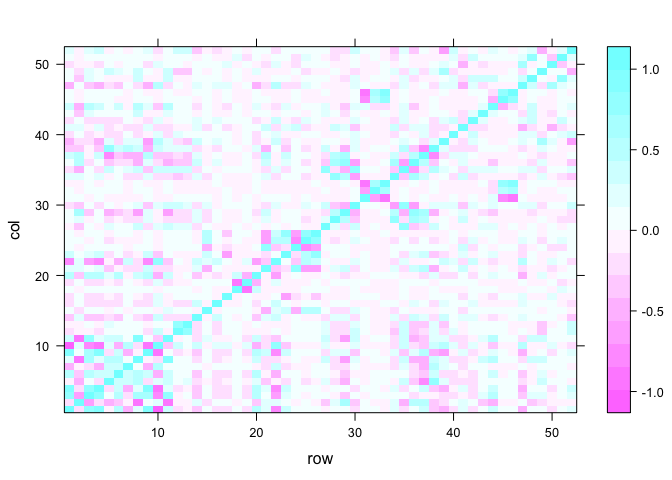

# Untitled


###Background
#####Using devices such as Jawbone Up, Nike FuelBand, and Fitbit it is now possible to collect a large amount of data about personal activity relatively inexpensively. These type of devices are part of the quantified self movement – a group of enthusiasts who take measurements about themselves regularly to improve their health, to find patterns in their behavior, or because they are tech geeks.
#####One thing that people regularly do is quantify how much of a particular activity they do, but they rarely quantify how well they do it. In this data set, the participants were asked to perform barbell lifts correctly and incorrectly in 5 different ways. More information is available from the website here: http://groupware.les.inf.puc-rio.br/har (see the section on the Weight Lifting Exercise Dataset).
#####In this project, the goal will be to use data from accelerometers on the belt, forearm, arm, and dumbell of 6 participants toto predict the manner in which praticipants did the exercise.
#####The dependent variable or response is the “classe” variable in the training set.

###Data
###Download and load the data.

```r
download.file("https://d396qusza40orc.cloudfront.net/predmachlearn/pml-training.csv", destfile = "./pml-training.csv")
download.file("http://d396qusza40orc.cloudfront.net/predmachlearn/pml-testing.csv", destfile = "./pml-testing.csv")
trainingOrg = read.csv("pml-training.csv", na.strings=c("", "NA", "NULL"))
# data.train =  read.csv("https://d396qusza40orc.cloudfront.net/predmachlearn/pml-training.csv", na.strings=c("", "NA", "NULL"))

testingOrg = read.csv("pml-testing.csv", na.strings=c("", "NA", "NULL"))
dim(trainingOrg)
```

```
## [1] 19622   160
```


```r
dim(testingOrg)
```

```
## [1]  20 160
```

###Pre-screening the data

#####There are several approaches for reducing the number of predictors.

#####. Remove variables that we believe have too many NA values.

```r
training.dena <- trainingOrg[ , colSums(is.na(trainingOrg)) == 0]
#head(training1)
#training3 <- training.decor[ rowSums(is.na(training.decor)) == 0, ]
dim(training.dena)
```

```
## [1] 19622    60
```
#####. Remove unrelevant variables There are some unrelevant variables that can be removed as they are unlikely to be related to dependent variable.

```r
remove = c('X', 'user_name', 'raw_timestamp_part_1', 'raw_timestamp_part_2', 'cvtd_timestamp', 'new_window', 'num_window')
training.dere <- training.dena[, -which(names(training.dena) %in% remove)]
dim(training.dere)
```

```
## [1] 19622    53
```
#####. Check the variables that have extremely low variance (this method is useful nearZeroVar() )

```r
library(caret)
```

```
## Warning: package 'caret' was built under R version 3.2.5
```

```
## Loading required package: lattice
```

```
## Loading required package: ggplot2
```


```r
# only numeric variabls can be evaluated in this way.
zeroVar= nearZeroVar(training.dere[sapply(training.dere, is.numeric)], saveMetrics = TRUE)
training.nonzerovar = training.dere[,zeroVar[, 'nzv']==0]
dim(training.nonzerovar)
```

```
## [1] 19622    53
```
#####. Remove highly correlated variables 90% (using for example findCorrelation() )

```r
# only numeric variabls can be evaluated in this way.
corrMatrix <- cor(na.omit(training.nonzerovar[sapply(training.nonzerovar, is.numeric)]))
dim(corrMatrix)
```

```
## [1] 52 52
```


```r
# there are 52 variables.
corrDF <- expand.grid(row = 1:52, col = 1:52)
corrDF$correlation <- as.vector(corrMatrix)
levelplot(correlation ~ row+ col, corrDF)
```

<!-- -->

##### We are going to remove those variable which have high correlation.

```r
removecor = findCorrelation(corrMatrix, cutoff = .90, verbose = TRUE)
```

```
## Compare row 10  and column  1 with corr  0.992 
##   Means:  0.27 vs 0.168 so flagging column 10 
## Compare row 1  and column  9 with corr  0.925 
##   Means:  0.25 vs 0.164 so flagging column 1 
## Compare row 9  and column  4 with corr  0.928 
##   Means:  0.233 vs 0.161 so flagging column 9 
## Compare row 8  and column  2 with corr  0.966 
##   Means:  0.245 vs 0.157 so flagging column 8 
## Compare row 19  and column  18 with corr  0.918 
##   Means:  0.091 vs 0.158 so flagging column 18 
## Compare row 46  and column  31 with corr  0.914 
##   Means:  0.101 vs 0.161 so flagging column 31 
## Compare row 46  and column  33 with corr  0.933 
##   Means:  0.083 vs 0.164 so flagging column 33 
## All correlations <= 0.9
```


```r
training.decor = training.nonzerovar[,-removecor]
dim(training.decor)
```

```
## [1] 19622    46
```
##### We get 19622 samples and 46 variables.

#####Split data to training and testing for cross validation.

```r
inTrain <- createDataPartition(y=training.decor$classe, p=0.7, list=FALSE)
training <- training.decor[inTrain,]; testing <- training.decor[-inTrain,]
dim(training);dim(testing)
```

```
## [1] 13737    46
```

```
## [1] 5885   46
```
##### We got 13737 samples and 46 variables for training, 5885 samples and 46 variables for testing.

### Analysis
##### Now we fit a tree to these data, and summarize and plot it. First, we use the 'tree' package. It is much faster than 'caret' package

```r
library(tree)
set.seed(12345)
tree.training=tree(classe~.,data=training)
summary(tree.training)
```

```
## 
## Classification tree:
## tree(formula = classe ~ ., data = training)
## Variables actually used in tree construction:
##  [1] "pitch_forearm"     "magnet_belt_y"     "accel_forearm_z"  
##  [4] "magnet_dumbbell_y" "roll_forearm"      "magnet_dumbbell_z"
##  [7] "pitch_belt"        "yaw_belt"          "accel_dumbbell_y" 
## [10] "accel_forearm_x"   "magnet_belt_z"     "accel_dumbbell_z" 
## [13] "gyros_belt_z"     
## Number of terminal nodes:  24 
## Residual mean deviance:  1.517 = 20800 / 13710 
## Misclassification error rate: 0.2838 = 3898 / 13737
```


```r
plot(tree.training)
text(tree.training,pretty=0, cex =.8)
```

<!-- -->
#####This is a busy tree and we are going to prune it.
##### For a detailed summary of the tree, print it:

```r
#tree.training 
```

####Rpart form Caret

```r
library(caret)
modFit <- train(classe ~ .,method="rpart",data=training)
```

```
## Loading required package: rpart
```

```r
print(modFit$finalModel)
```

```
## n= 13737 
## 
## node), split, n, loss, yval, (yprob)
##       * denotes terminal node
## 
##  1) root 13737 9831 A (0.28 0.19 0.17 0.16 0.18)  
##    2) pitch_forearm< -26.65 1201   52 A (0.96 0.043 0 0 0) *
##    3) pitch_forearm>=-26.65 12536 9779 A (0.22 0.21 0.19 0.18 0.2)  
##      6) magnet_belt_y>=554.5 11541 8784 A (0.24 0.23 0.21 0.18 0.15)  
##       12) magnet_dumbbell_y< 437.5 9596 6901 A (0.28 0.18 0.24 0.17 0.13)  
##         24) roll_forearm< 122.5 6085 3666 A (0.4 0.18 0.19 0.15 0.092) *
##         25) roll_forearm>=122.5 3511 2332 C (0.079 0.17 0.34 0.22 0.19)  
##           50) accel_forearm_x>=-100.5 2427 1494 C (0.088 0.21 0.38 0.087 0.23) *
##           51) accel_forearm_x< -100.5 1084  521 D (0.057 0.1 0.23 0.52 0.095) *
##       13) magnet_dumbbell_y>=437.5 1945 1036 B (0.032 0.47 0.043 0.21 0.25) *
##      7) magnet_belt_y< 554.5 995  183 E (0 0.002 0 0.18 0.82) *
```

####Prettier plots

```r
library(rattle)
```

```
## Warning: Failed to load RGtk2 dynamic library, attempting to install it.
```

```
## Please install GTK+ from http://r.research.att.com/libs/GTK_2.24.17-X11.pkg
```

```
## If the package still does not load, please ensure that GTK+ is installed and that it is on your PATH environment variable
```

```
## IN ANY CASE, RESTART R BEFORE TRYING TO LOAD THE PACKAGE AGAIN
```

```
## Rattle: A free graphical interface for data mining with R.
## Version 4.1.0 Copyright (c) 2006-2015 Togaware Pty Ltd.
## Type 'rattle()' to shake, rattle, and roll your data.
```


```r
fancyRpartPlot(modFit$finalModel)
```

<!-- -->
##### The result from 'caret' 'rpart' package is close to 'tree' package.

#### Cross Validation
##### We are going to check the performance of the tree on the testing data by cross validation.

```r
tree.pred=predict(tree.training,testing,type="class")
predMatrix = with(testing,table(tree.pred,classe))
sum(diag(predMatrix))/sum(as.vector(predMatrix)) # error rate
```

```
## [1] 0.7162277
```

##### The 0.70 is not very accurate.

```r
tree.pred=predict(modFit,testing)
predMatrix = with(testing,table(tree.pred,classe))
sum(diag(predMatrix))/sum(as.vector(predMatrix)) # error rate
```

```
## [1] 0.5014444
```
##### The 0.50 from 'caret' package is much lower than the result from 'tree' package.

#### Pruning tree

##### This tree was grown to full depth, and might be too variable. We now use Cross Validation to prune it.

```r
cv.training=cv.tree(tree.training,FUN=prune.misclass)
cv.training
```

```
## $size
##  [1] 24 23 22 21 20 18 17 16 13  7  5  1
## 
## $dev
##  [1] 3990 4180 4298 4369 4818 4933 4947 5130 6521 6616 7274 9831
## 
## $k
##  [1]     -Inf  93.0000 104.0000 116.0000 133.0000 140.5000 142.0000
##  [8] 157.0000 199.6667 203.8333 261.5000 640.5000
## 
## $method
## [1] "misclass"
## 
## attr(,"class")
## [1] "prune"         "tree.sequence"
```


```r
plot(cv.training)
```

<!-- -->
##### It shows that when the size of the tree goes down, the deviance goes up. It means the 21 is a good size (i.e. number of terminal nodes) for this tree. We do not need to prune it.

##### Suppose we prune it at size of nodes at 18.

```r
prune.training=prune.misclass(tree.training,best=18)
#plot(prune.training);text(prune.training,pretty=0,cex =.8 )
```

##### Now lets evaluate this pruned tree on the test data.

```r
tree.pred=predict(prune.training,testing,type="class")
predMatrix = with(testing,table(tree.pred,classe))
sum(diag(predMatrix))/sum(as.vector(predMatrix)) # error rate
```

```
## [1] 0.6679694
```
##### 0.66 is a little less than 0.70, so pruning did not hurt us with repect to misclassification errors, and gave us a simpler tree. We use less predictors to get almost the same result. By pruning, we got a shallower tree, which is easier to interpret.

#####The single tree is not good enough, so we are going to use bootstrap to improve the accuracy. We are going to try random forests.

### Random Forests
##### These methods use trees as building blocks to build more complex models.
##### Random Forests
##### Random forests build lots of bushy trees, and then average them to reduce the variance.

```r
require(randomForest)
```

```
## Loading required package: randomForest
```

```
## randomForest 4.6-12
```

```
## Type rfNews() to see new features/changes/bug fixes.
```

```
## 
## Attaching package: 'randomForest'
```

```
## The following object is masked from 'package:ggplot2':
## 
##     margin
```


```r
set.seed(12345)
```
##### Lets fit a random forest and see how well it performs.

```r
rf.training=randomForest(classe~.,data=training,ntree=100, importance=TRUE)
rf.training
```

```
## 
## Call:
##  randomForest(formula = classe ~ ., data = training, ntree = 100,      importance = TRUE) 
##                Type of random forest: classification
##                      Number of trees: 100
## No. of variables tried at each split: 6
## 
##         OOB estimate of  error rate: 0.69%
## Confusion matrix:
##      A    B    C    D    E  class.error
## A 3903    3    0    0    0 0.0007680492
## B   18 2632    7    0    1 0.0097817908
## C    0   14 2376    5    1 0.0083472454
## D    0    0   35 2215    2 0.0164298401
## E    0    2    1    6 2516 0.0035643564
```


```r
#plot(rf.training, log="y")
varImpPlot(rf.training,)
```

<!-- -->


```r
#rf.training1=randomForest(classe~., data=training, proximity=TRUE )
#DSplot(rf.training1, training$classe)
```
##### we can see which variables have higher impact on the prediction.

#### Out-of Sample Accuracy
##### Our Random Forest model shows OOB estimate of error rate: 0.72% for the training data. Now we will predict it for out-of sample accuracy.

##### Now lets evaluate this tree on the test data.

```r
tree.pred=predict(rf.training,testing,type="class")
predMatrix = with(testing,table(tree.pred,classe))
sum(diag(predMatrix))/sum(as.vector(predMatrix)) # error rate
```

```
## [1] 0.9930331
```
##### 0.99 means we got a very accurate estimate.

##### No. of variables tried at each split: 6. It means every time we only randomly use 6 predictors to grow the tree. Since p = 43, we can have it from 1 to 43, but it seems 6 is enough to get the good result.

#### Conclusion
##### Now we can predict the testing data from the website.

```r
answers <- predict(rf.training, testingOrg)
answers
```

```
##  1  2  3  4  5  6  7  8  9 10 11 12 13 14 15 16 17 18 19 20 
##  B  A  B  A  A  E  D  B  A  A  B  C  B  A  E  E  A  B  B  B 
## Levels: A B C D E
```
#### It shows that this random forest model did a good job.


